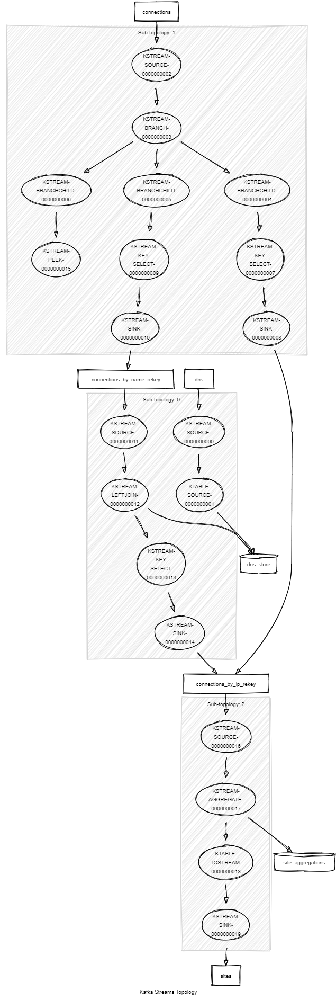

# KStream connection aggregation example

This is a simple Kafka Stream project that aggregates connections to servers.

## Input 

The application consumes 2 topics:

- connections: represents a connection to a server

A connection to a server is done by providing either the server ip address.

```json
{
  "sourceIp":"147.154.12.54",
  "serverIp":"127.0.0.1"
}
```

Or the server name.

```json
{
  "sourceIp":"147.154.12.54",
  "serverName":"localhost"
}
``` 

If none is specified, the connection is considered invalid. The key the messages are ignored.

- dns: contains the server name to ip address mapping

The key is the server name and the value the ip address.

## Output

The application pushes aggregated connection by servers.

```json
{
  "ip": "127.0.0.1",
  "sourceIps": [
    {
      "ip": "147.154.12.54",
      "timestamp": "2019-07-04T16:06:49.0458772"
    },
    {
      "ip": "147.154.12.54",
      "timestamp": "2019-07-04T16:07:15.5910779"
    }
  ]
}
``` 

## Implementation

The `dns` topic is consumed as a KTable.

The `connections` topic is consumed as a KStream and split in 3:

- The invalid messages (no server id/name)

These will just be logged as errors.

- The connections by ip

These will by re-keyed so the key of the messages will now be the server id and sent to the `connections_by_ip_rekey`.

- The connections by address

These will be joined with the dns KTable so the server id will be resolved from its name.
Then the messages will be treated just like the messages from the previous branch (re-key + push).

Then all connection messages from `connections_by_ip_rekey` will be grouped by key and aggregated into a message containing 
the server ip and all connection events.

## Topology



## Run the app 

```sh
# Run app
./gradlew bootRun

#Run tests (note the clean to ensure the state store is cleaned up)
./gradlew clean test
```
